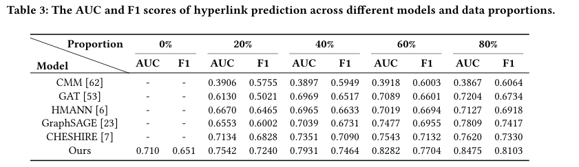
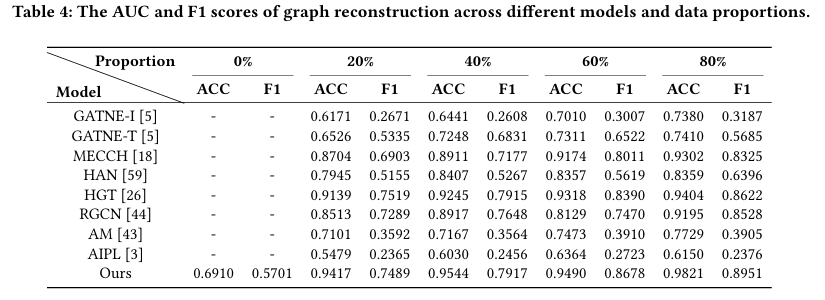
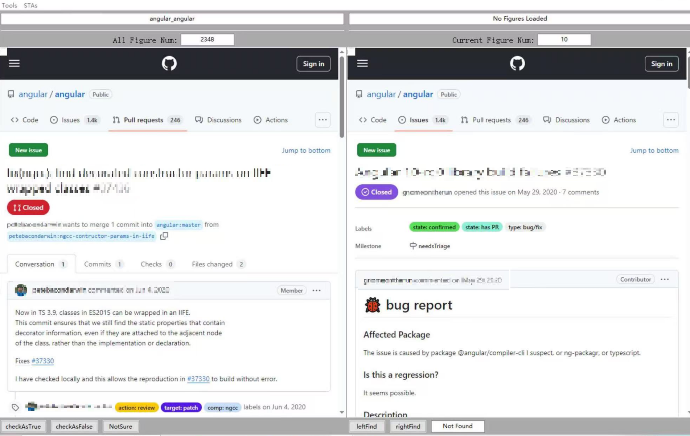

# Repository Overview: Code and Data for "Coherent and Traceable Issue and Pull Request Link Recovery with Hyperlink Prediction"

### 1. Repository Structure

- **DataStructure Package**  
  Defines main data types for:  
  - **Artifacts** (e.g., PR and Issue)  
  - **Hyperlinks** (collections of artifacts)  

- **GraphLinker Package**  
  Implements the **GraphLinker** model with two modules:  
  - **HP Module**:  
    - Extracts high-order structure-semantic features  
    - Combines hybrid LLM (BAAI) with GAT strategies  
    - Performs hyperlink prediction  
  - **P2P Module**:  
    - Uses **metapath-aggregation** strategy to convert path features into link-level predictions  
    - Performs link prediction  

- **MongoDB_CheckImp Package**  
  Provides tools for **double-blind sampling verification**:  
  - Visualization interface  
  - Data warehouse  
  - Partially verified experimental results  

- **ProcessesHooK Package**  
  Contains:  
  - Experimental process control tools  
  - Implementation of **EarlyStopping** techniques  

- **Other Files**  
  - `requirements.txt`: Lists dependencies  
  - `run_main.sh`: Commands for experiments on 11 repositories  
  - `main.py`: Main experimental workflow implementation  


### 2. Reproducing Experimental Results

- **Reproducing HP Prediction Results**  
  - Use `-tt` and `-l` parameters in `main.py`:
    - `-tt` controls feature types:
      - `1`: Semantic features
      - `2`: Structural features  
      - `3`: Combined features
    - `-l`: Enables LOPO strategy
  - Example command:
    ```bash
    nohup bash -c "CUDA_VISIBLE_DEVICES=$num_GPU python -u main.py -r $repoName -tt 3" > "./runlog_training_main/${repoName}.log" 2>&1 &
    ```
  - Results visualization:
    <div style="text-align: center;">
      
    </div>

- **Reproducing P2P Prediction Results**  
  - Use `-hp` parameter in `main.py` for P2P mode
  - Example command:
    ```bash
    nohup bash -c "CUDA_VISIBLE_DEVICES=$num_GPU python -u main.py -r $repoName -tt 3 -hp" > "./runlog_training_main/${repoName}.log" 2>&1 &
    ```
  - Results visualization:
    <div style="text-align: center;">
      
    </div>


### 3. Data Preprocessing Module

#### **3.1 Double-Blind Validation Tool**
The **MongoDB_CheckImp** package includes a **CheckGUI** tool for double-blind validation. The validation process is illustrated below:
<div style="text-align: center;">
  
</div>
